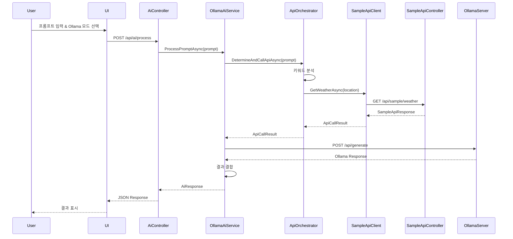
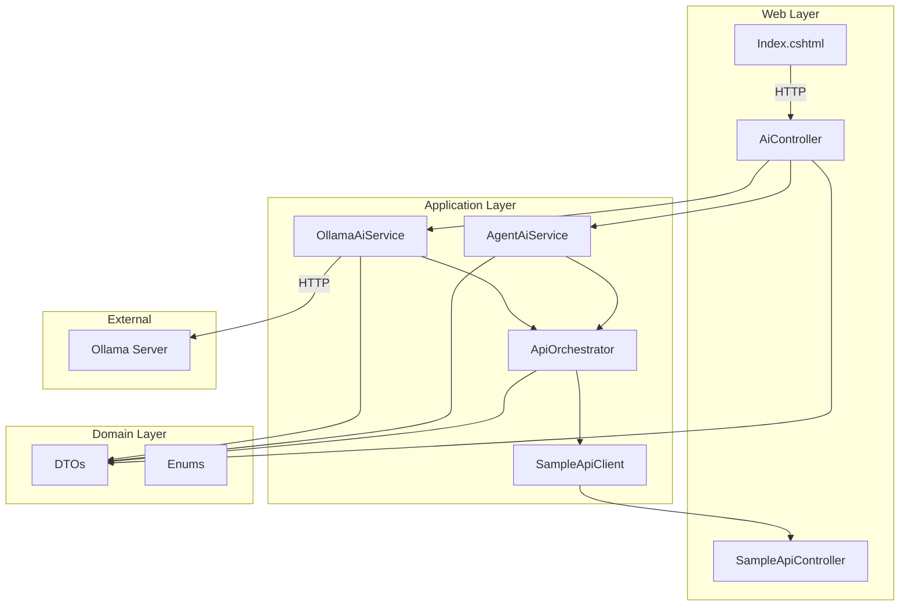

# Design Document

## Overview

AI API Orchestrator는 .NET 9 기반의 ASP.NET Web 애플리케이션으로, 사용자의 자연어 프롬프트를 AI가 분석하여 적절한 Sample API를 호출하고 결과를 반환하는 시스템입니다. 

핵심 설계 원칙:
- **계층형 아키텍처**: Domain, Application, Web 계층으로 명확히 분리
- **의존성 주입**: 느슨한 결합과 테스트 용이성 확보
- **전략 패턴**: 다양한 AI 서비스를 동적으로 선택 가능
- **확장성**: 새로운 AI 서비스나 Sample API를 쉽게 추가 가능

## Architecture

### 계층 구조

```
┌─────────────────────────────────────────┐
│           Web Layer                     │
│  - Controllers                          │
│  - Razor Pages                          │
│  - Program.cs (DI 설정)                 │
└──────────────┬──────────────────────────┘
               │ 의존
┌──────────────▼──────────────────────────┐
│        Application Layer                │
│  - AI Service Interfaces                │
│  - AI Service Implementations           │
│  - API Orchestrator                     │
│  - Sample API Clients                   │
└──────────────┬──────────────────────────┘
               │ 의존
┌──────────────▼──────────────────────────┐
│          Domain Layer                   │
│  - DTOs (Request/Response)              │
│  - Enums (AI Mode)                      │
└─────────────────────────────────────────┘
```

### 프로젝트 구조

```
AiApiOrchestrator/
├── Domain/
│   ├── Dtos/
│   │   ├── AiRequest.cs
│   │   ├── AiResponse.cs
│   │   ├── ApiCallResult.cs
│   │   └── SampleApiResponse.cs
│   └── Enums/
│       └── AiMode.cs
├── Application/
│   ├── Interfaces/
│   │   ├── IAiService.cs
│   │   ├── IOllamaAiService.cs
│   │   ├── IAgentAiService.cs
│   │   └── IApiOrchestrator.cs
│   ├── Services/
│   │   ├── OllamaAiService.cs
│   │   ├── AgentAiService.cs
│   │   └── ApiOrchestrator.cs
│   └── SampleApis/
│       ├── ISampleApiClient.cs
│       └── SampleApiClient.cs
├── Web/
│   ├── Controllers/
│   │   ├── AiController.cs
│   │   └── SampleApiController.cs
│   ├── Pages/
│   │   ├── Index.cshtml
│   │   └── Index.cshtml.cs
│   ├── wwwroot/
│   │   ├── css/
│   │   │   └── site.css
│   │   └── js/
│   │       └── site.js
│   ├── Program.cs
│   └── appsettings.json
└── AiApiOrchestrator.csproj
```

## Components and Interfaces

### 1. Domain Layer

#### AiMode Enum
AI 연동 모드를 정의하는 열거형입니다.

```csharp
public enum AiMode
{
    Ollama,
    Agent
}
```

#### DTOs

**AiRequest**: 클라이언트에서 AI 서비스로 전송되는 요청
- `string Prompt`: 사용자 입력 프롬프트
- `AiMode Mode`: 선택된 AI 모드

**AiResponse**: AI 서비스에서 클라이언트로 반환되는 응답
- `string Result`: AI 처리 결과
- `string ApiCalled`: 호출된 Sample API 이름
- `bool Success`: 성공 여부
- `string ErrorMessage`: 오류 메시지 (실패 시)

**ApiCallResult**: Sample API 호출 결과
- `string ApiName`: API 이름
- `object Data`: API 응답 데이터
- `bool Success`: 성공 여부

**SampleApiResponse**: Sample API의 표준 응답 형식
- `string Message`: 응답 메시지
- `object Data`: 응답 데이터

### 2. Application Layer

#### Interfaces

**IAiService**: 모든 AI 서비스의 기본 인터페이스
```csharp
Task<AiResponse> ProcessPromptAsync(string prompt);
```

**IOllamaAiService**: Ollama 전용 인터페이스 (IAiService 상속)

**IAgentAiService**: Agent 전용 인터페이스 (IAiService 상속)

**IApiOrchestrator**: API 판단 및 호출을 담당하는 오케스트레이터 인터페이스
```csharp
Task<ApiCallResult> DetermineAndCallApiAsync(string prompt);
```

**ISampleApiClient**: Sample API 호출 클라이언트 인터페이스
```csharp
Task<SampleApiResponse> GetWeatherAsync(string location);
Task<SampleApiResponse> GetStockInfoAsync(string symbol);
Task<SampleApiResponse> GetNewsAsync(string topic);
```

#### Services

**OllamaAiService**: Ollama API와 HTTP 통신하는 서비스
- Ollama 로컬 서버(http://localhost:11434)에 HTTP POST 요청
- "llama3" 모델 사용
- IHttpClientFactory를 통해 HttpClient 주입
- ApiOrchestrator를 사용하여 Sample API 판단 및 호출
- Ollama의 응답과 API 호출 결과를 결합하여 반환

**AgentAiService**: 더미 Agent 로직을 구현하는 서비스
- 실제 외부 AI 서비스 없이 동작
- ApiOrchestrator를 사용하여 Sample API 판단 및 호출
- 더미 응답과 API 호출 결과를 결합하여 반환

**ApiOrchestrator**: 프롬프트를 분석하여 적절한 Sample API를 판단하고 호출
- 키워드 기반 매칭 로직 사용
- "날씨", "weather" → GetWeather API
- "주식", "stock" → GetStockInfo API
- "뉴스", "news" → GetNews API
- ISampleApiClient를 통해 실제 API 호출
- 확장 가능한 Dictionary 기반 매핑 구조

**SampleApiClient**: Sample API를 호출하는 클라이언트
- 실제로는 내부 Controller를 호출하거나 더미 데이터 반환
- IHttpClientFactory를 사용하여 자체 API 호출 (선택적)
- 또는 직접 더미 데이터 생성

### 3. Web Layer

#### Controllers

**AiController**: AI 요청을 처리하는 메인 컨트롤러
- `POST /api/ai/process`: AI 요청 처리 엔드포인트
- AiRequest를 받아 선택된 모드에 따라 적절한 AI 서비스 호출
- 서비스 팩토리 패턴 또는 Dictionary를 사용하여 동적 서비스 선택

**SampleApiController**: Sample API 엔드포인트 제공
- `GET /api/sample/weather?location={location}`: 날씨 정보 반환
- `GET /api/sample/stock?symbol={symbol}`: 주식 정보 반환
- `GET /api/sample/news?topic={topic}`: 뉴스 정보 반환
- 더미 데이터를 JSON 형식으로 반환

#### Razor Pages

**Index.cshtml / Index.cshtml.cs**: 메인 UI 페이지
- 프롬프트 입력 텍스트 영역
- AI 모드 선택 드롭다운 (Ollama/Agent)
- 전송 버튼
- 결과 표시 영역
- JavaScript를 사용하여 /api/ai/process 엔드포인트 호출
- 응답을 결과 영역에 표시

#### Program.cs

DI 컨테이너 설정 및 애플리케이션 구성:
```csharp
// HttpClient 등록
builder.Services.AddHttpClient();

// AI Services 등록
builder.Services.AddScoped<IOllamaAiService, OllamaAiService>();
builder.Services.AddScoped<IAgentAiService, AgentAiService>();

// Orchestrator 및 Sample API Client 등록
builder.Services.AddScoped<IApiOrchestrator, ApiOrchestrator>();
builder.Services.AddScoped<ISampleApiClient, SampleApiClient>();

// Controllers 및 Razor Pages 등록
builder.Services.AddControllers();
builder.Services.AddRazorPages();
```

## Data Models

### Request Flow

```
User Input (UI)
    ↓
AiRequest { Prompt, Mode }
    ↓
AiController
    ↓
[Mode 선택]
    ↓
IOllamaAiService 또는 IAgentAiService
    ↓
IApiOrchestrator.DetermineAndCallApiAsync(prompt)
    ↓
[키워드 분석]
    ↓
ISampleApiClient.GetWeatherAsync() / GetStockInfoAsync() / GetNewsAsync()
    ↓
SampleApiController (내부 API)
    ↓
ApiCallResult
    ↓
AiResponse { Result, ApiCalled, Success }
    ↓
User Output (UI)
```

### Ollama API Request/Response

**Request to Ollama**:
```json
{
  "model": "llama3",
  "prompt": "사용자 프롬프트",
  "stream": false
}
```

**Response from Ollama**:
```json
{
  "model": "llama3",
  "response": "AI 생성 응답",
  "done": true
}
```

### Sample API Responses

**Weather API**:
```json
{
  "message": "Weather information retrieved",
  "data": {
    "location": "Seoul",
    "temperature": "15°C",
    "condition": "Sunny"
  }
}
```

**Stock API**:
```json
{
  "message": "Stock information retrieved",
  "data": {
    "symbol": "AAPL",
    "price": "$150.25",
    "change": "+2.5%"
  }
}
```

**News API**:
```json
{
  "message": "News retrieved",
  "data": {
    "topic": "Technology",
    "headline": "Latest tech news",
    "summary": "Summary of the news"
  }
}
```

## Error Handling

### Exception Handling Strategy

1. **Controller Level**: try-catch로 예외를 잡아 적절한 HTTP 상태 코드 반환
   - 400 Bad Request: 잘못된 요청 데이터
   - 500 Internal Server Error: 서버 내부 오류

2. **Service Level**: 예외를 로깅하고 AiResponse에 오류 정보 포함
   - Success = false
   - ErrorMessage에 오류 내용 설정

3. **HTTP Client**: HttpClient 호출 실패 시 재시도 로직 없이 즉시 실패 처리
   - Ollama 서버 연결 실패 시 명확한 오류 메시지 반환

### Error Response Format

```csharp
{
  "result": "",
  "apiCalled": "",
  "success": false,
  "errorMessage": "Ollama 서버에 연결할 수 없습니다. http://localhost:11434가 실행 중인지 확인하세요."
}
```

## Testing Strategy

### Unit Testing

1. **Service Tests**:
   - OllamaAiService: Mock HttpClient를 사용하여 Ollama API 호출 테스트
   - AgentAiService: 더미 로직 동작 검증
   - ApiOrchestrator: 키워드 매칭 로직 테스트

2. **Controller Tests**:
   - AiController: Mock 서비스를 사용하여 요청/응답 테스트
   - SampleApiController: 더미 데이터 반환 검증

### Integration Testing

1. **End-to-End Flow**:
   - UI에서 프롬프트 입력 → AI 처리 → Sample API 호출 → 결과 반환
   - Ollama 모드와 Agent 모드 각각 테스트

2. **API Testing**:
   - Sample API 엔드포인트 직접 호출 테스트
   - 다양한 파라미터로 응답 검증

### Manual Testing

1. **UI Testing**:
   - 브라우저에서 Index 페이지 접속
   - 다양한 프롬프트 입력 테스트
   - 모드 전환 테스트

2. **Ollama Integration**:
   - Ollama 서버 실행 상태에서 테스트
   - Ollama 서버 미실행 상태에서 오류 처리 테스트

## Configuration

### appsettings.json

```json
{
  "Logging": {
    "LogLevel": {
      "Default": "Information",
      "Microsoft.AspNetCore": "Warning"
    }
  },
  "AllowedHosts": "*",
  "OllamaSettings": {
    "BaseUrl": "http://localhost:11434",
    "Model": "llama3",
    "TimeoutSeconds": 30
  },
  "SampleApiSettings": {
    "BaseUrl": "http://localhost:5000"
  }
}
```

### Configuration Classes

**OllamaSettings**:
```csharp
public class OllamaSettings
{
    public string BaseUrl { get; set; }
    public string Model { get; set; }
    public int TimeoutSeconds { get; set; }
}
```

설정은 Program.cs에서 Options 패턴으로 주입:
```csharp
builder.Services.Configure<OllamaSettings>(
    builder.Configuration.GetSection("OllamaSettings"));
```

## Security Considerations

이 프로젝트는 레퍼런스 목적이므로 인증/권한은 포함하지 않지만, 프로덕션 환경에서는 다음을 고려해야 합니다:

1. **API 인증**: Sample API에 API Key 또는 JWT 토큰 인증 추가
2. **Rate Limiting**: AI 요청에 대한 속도 제한
3. **Input Validation**: 프롬프트 입력에 대한 검증 및 새니타이징
4. **CORS**: 필요한 경우 CORS 정책 설정

## Performance Considerations

1. **비동기 처리**: 모든 I/O 작업은 async/await 사용
2. **HttpClient 재사용**: IHttpClientFactory를 통한 HttpClient 관리
3. **캐싱**: 자주 호출되는 Sample API 결과 캐싱 (선택적)
4. **타임아웃**: Ollama API 호출에 적절한 타임아웃 설정

## Extensibility

### 새로운 AI 서비스 추가

1. IAiService를 구현하는 새 인터페이스 생성
2. 서비스 클래스 구현
3. Program.cs에 DI 등록
4. AiController에서 새 모드 처리 로직 추가

### 새로운 Sample API 추가

1. SampleApiController에 새 엔드포인트 추가
2. ISampleApiClient에 새 메서드 정의
3. SampleApiClient에 구현 추가
4. ApiOrchestrator의 키워드 매핑에 새 API 추가

### API 판단 로직 고도화

현재는 단순 키워드 매칭이지만, 향후 다음과 같이 확장 가능:
- 정규표현식 기반 매칭
- ML 모델을 사용한 의도 분류
- Ollama/Agent의 응답을 파싱하여 API 결정
- Function Calling 패턴 적용

## Deployment

### Development Environment

```bash
dotnet run --project Web
```

브라우저에서 http://localhost:5000 접속

### Production Considerations

- IIS 또는 Kestrel 서버 사용
- 환경별 appsettings 분리 (Development, Production)
- 로깅 설정 (Serilog, NLog 등)
- Health Check 엔드포인트 추가

## Design Decisions and Rationales

### 1. 계층형 아키텍처 선택
**결정**: Domain, Application, Web 3계층 분리

**이유**: 
- 관심사의 명확한 분리
- 테스트 용이성
- 코드 재사용성
- 유지보수성 향상

### 2. 인터페이스 기반 설계
**결정**: 모든 서비스에 인터페이스 정의

**이유**:
- 느슨한 결합
- Mock을 사용한 단위 테스트 가능
- 구현체 교체 용이

### 3. ApiOrchestrator 분리
**결정**: API 판단 로직을 별도 클래스로 분리

**이유**:
- 단일 책임 원칙
- AI 서비스와 API 호출 로직의 분리
- 판단 로직의 독립적인 테스트 및 확장

### 4. 키워드 기반 매칭
**결정**: 단순한 키워드 매칭으로 API 판단

**이유**:
- 레퍼런스 프로젝트로서의 단순성
- 이해하기 쉬운 로직
- 향후 고도화 가능한 구조

### 5. 더미 Sample API
**결정**: 실제 외부 API 대신 내부 더미 API 사용

**이유**:
- 외부 의존성 제거
- 독립적인 실행 가능
- 테스트 용이성

## Diagrams

### Sequence Diagram: Ollama Mode Request Flow



### Component Diagram



## Summary

이 설계는 .NET 9의 최신 기능을 활용하면서도 단순하고 이해하기 쉬운 구조를 유지합니다. 계층형 아키텍처와 의존성 주입을 통해 확장 가능하고 테스트 가능한 코드를 제공하며, 레퍼런스 프로젝트로서 따라하기 쉬운 명확한 패턴을 제시합니다.
